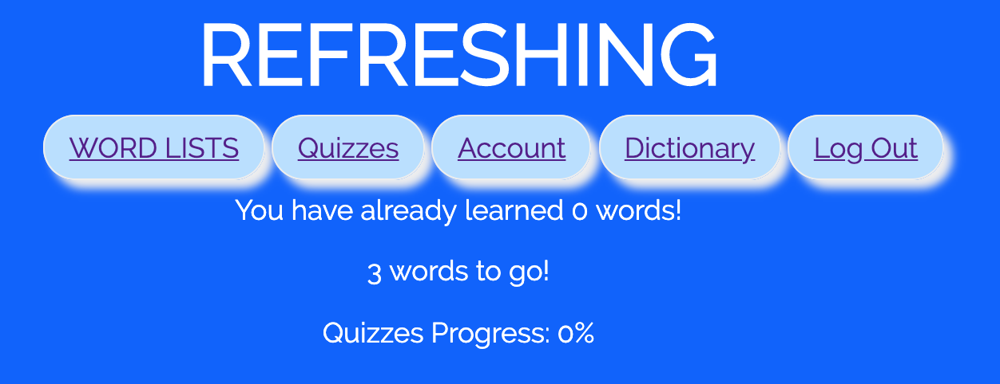

# Refreshing GRE Flash Cards

## Overview

Remembering the GRE vocabulary is waaaaay too difficult, especially for people who use English as a second language. Also, bringing a vocabulary book everywhere is tiresome. Sooo... that's where Refreshing GRE Flash Cards comes in!

Refreshing GRE Flash Cards is a web app that will allow users to learn GRE vocabulary and take quizzes. Users can register and login. Once they're logged in, they can learn the vocabulary. They can take tests on different word lists and see their scores. Once they get full marks for a module test, the progress bar will be updated. Users can also use this web app as a dictionary by looking up words that they do not know on this app. They can also see how many words they still have to remember. In addition, they can add words to this vocabulary if they want.

## Data Model

The application will store Users, Vocabulary and Modules

* users can have multiple lists (via references)
* each list can have multiple items (by embedding)

An Example User:

```javascript
{
  user: "Osborn",
  password: // a password hash
}
```

An Example Vocabulary:

```javascript
{
  word: "fastidious",
  meaning: "Giving careful attention to detail; hard to please",
  correctness: false, // the user has not been tested on this word or the user fail to recall the meaning of this word during the test
  confusion: ["indestructible, impervious to harm", "harmful or hostile", "Giving careful attention to detail; hard to please"], // a list of meanings including a correct meaning for the word, used for quizzes
  moduleID: 'module1' // the Module the word is put in
}
```


## [Link to Commented First Draft Schema](src/db.js) 


## Wireframes

/gre - page for loging in


/gre/register - page for registering


/gre/lists - page for vocabulary list


/gre/quiz - page for quizzes


/gre/account - page for account management



/gre/dictionary - page for the dictionary


## [Site map](documentation/7.jpg)

## User Stories or Use Cases

1. as non-registered user, I can register a new account with the site
2. as a user, I can log in to the site
3. as a user, I can see the vocabulary and learn it
4. as a user, I can take the quizzes and see my grades
5. as a user, I can check my account and see how I progress
6. as a user, I can add new words to the dictionary or look up a word in dictionary
7. as a user, I can log out of the account to switch an account or re-login

## Research Topics

* (2 points) Use a CSS preprocesser
    * SASS
* (5 points) vue.js
    * used vue.js as the frontend framework; it's a challenging library to learn, so I've assigned it 5 points
* (1 points) bcryptjs
    * used bcryptjs to hash the password for users.
* (1 points) mongoose-unique-validator
    * used mongoose-unique-validator to make the word in Vocabulary schema unique.

## [Link to Initial Main Project File](src/app.js) 

## Annotations / References Used

1. [tutorial on SASS](https://www.youtube.com/watch?v=roywYSEPSvc)

2. [tutorial on vue.js](https://vuejs.org/v2/guide/)

3. [documentation on bcrypt.js](https://www.npmjs.com/package/bcryptjs)

4. [documentation on mongoose-unique-validator](https://www.npmjs.com/package/mongoose-unique-validator)
