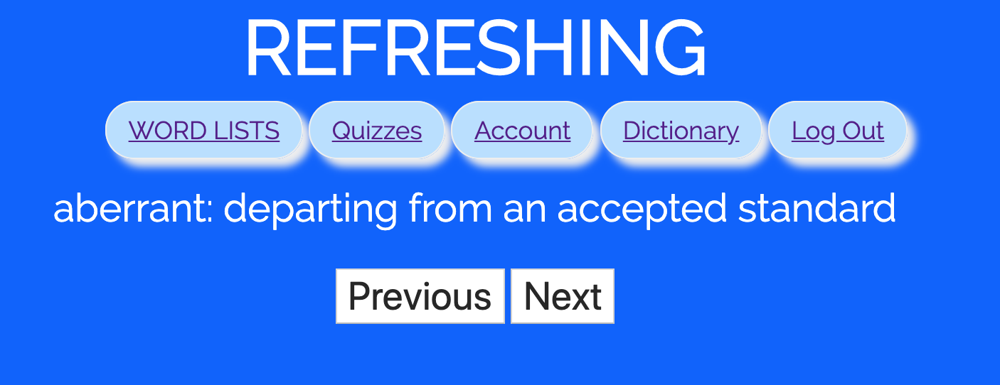
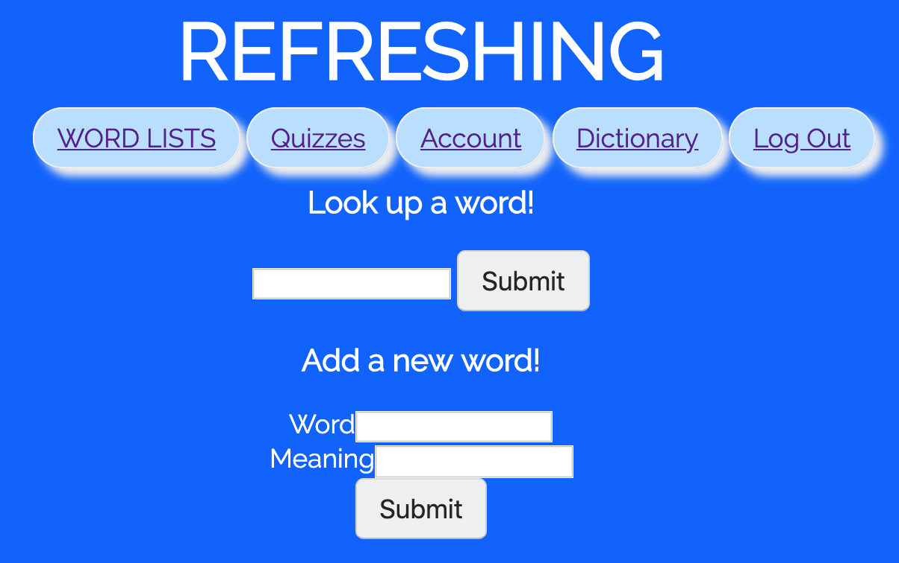

# Refreshing GRE Flash Cards

## Overview

Remembering the GRE vocabulary is waaaaay too difficult, especially for people who use English as a second language. Also, bringing a vocabulary book everywhere is tiresome. Sooo... that's where Refreshing GRE Flash Cards comes in!

Refreshing GRE Flash Cards is a web app that will allow users to learn GRE vocabulary and take quizzes. Users can register and login. Once they're logged in, they can learn the vocabulary by category. They can take tests on different word lists and see their scores. The words that they do not recognize during the tests will be put in the notes so that they can learn those words from time to time. Once they get full marks for a module test, the progress bar will be updated. Users can also use this web app as a dictionary by looking up words that they do not know on this app. They can also see how many words they still have to remember. In addition, they can add words to this vocabulary if they want.

## Data Model

The application will store Users, Vocabulary and Modules

* users can have multiple lists (via references)
* each list can have multiple items (by embedding)

(___TODO__: sample documents_)

An Example User:

```javascript
{
  user: "Osborn",
  password: // a password hash,
  lists: // an array of references to Modules documents
}
```

An Example Vocabulary:

```javascript
{
  word: "fastidious",
  meaning: "Giving careful attention to detail; hard to please",
  correctness: false, // the user has not been tested on this word or the user fail to recall the meaning of this word during the test
  sentence: "She was too fastidious to do anything that might get her dirty."//    example of how to use this word
}
```

An Example Modules with embedded Vocabulary:

```javascript
{
  portion: 50%, // the portion of times of recognizing words correctly during the test (the best one)
  user: // a reference to a User object
  name: "Module 1",
  vocabulary: [
    {
      word: "fastidious",
      meaning: "Giving careful attention to detail; hard to please",
      correctness: false,
      sentence: "She was too fastidious to do anything that might get her dirty."
    },
    {
      word: "Disingenuous",
      meaning: "not candid or sincere",
      correctness: true,
      sentence: "But shamelessly self-interested and probably contrary to his real views on the EU though it is, the mayor’s move is perhaps not entirely disingenuous."
    }
  ]
}
```


## [Link to Commented First Draft Schema](src/db.js) 


## Wireframes

(___TODO__: wireframes for all of the pages on your site; they can be as simple as photos of drawings or you can use a tool like Balsamiq, Omnigraffle, etc._)

/gre - page for loging in


/gre/register - page for registering


/gre/lists - page for vocabulary list



/gre/quiz - page for quizzes


/gre/account - page for account management


/gre/dictionary - page for the dictionary



## [Site map](documentation/7.jpg)

## User Stories or Use Cases

1. as non-registered user, I can register a new account with the site
2. as a user, I can log in to the site
3. as a user, I can see the vocabulary and learn it
4. as a user, I can take the quizzes and see my grades
5. as a user, I can check my account and see how I progress
6. as a user, I can add new words to the dictionary or look up a word in dictionary
7. as a user, I can log out of the account to switch an account or re-login

## Research Topics

* (5 points) Integrate user authentication
    * I'm going to be using passport for user authentication
    * And account has been made for testing; I'll include the password in the comments
* (4 points) Perform client side form validation using a JavaScript library
    * if you look up a word that is not contained in the dictionary, an error message will appear in the dom
* (5 points) vue.js
    * used vue.js as the frontend framework; it's a challenging library to learn, so I've assigned it 5 points


## [Link to Initial Main Project File](src/app.js) 

## Annotations / References Used

1. [passport.js authentication docs](http://passportjs.org/docs)
2. [tutorial on vue.js](https://vuejs.org/v2/guide/)
